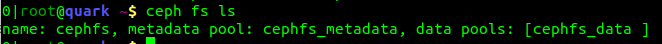
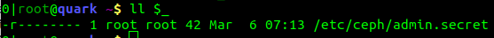
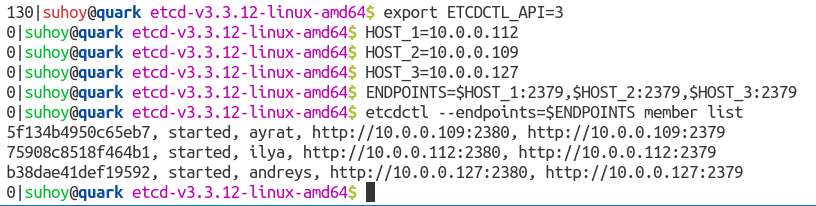
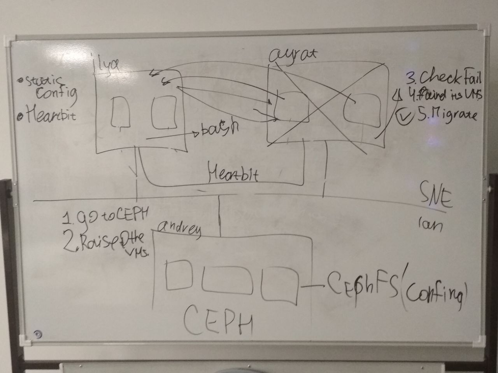
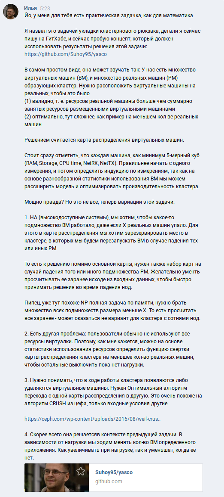

# YASCO - Yet Another Static Cluster Orchestration

Orchestration of virtual machine with [libvirt](https://libvirt.org/) &amp;
[etcd](https://github.com/etcd-io/etcd) &amp; [ceph](http://docs.ceph.com/docs/master/).

## Table Of Content

[TOC]

## Preface

This is moment, when you are studying [SNE](https://os3.su/), doing Virtual Machine
Management lab with Cloud Orchestration. But it is the last night before deadline,
And figuring out the other monsters orchestration systems is too late, and I'm doubting
about its design and clearness. So It is better to use brute force and
DO IT YOURSELF with python.


Generally, we wants solve with orchestration two problems:

- Automatic high available resolving (i.e. evacuating VM instances)
- Efficient cluster utilizing (i.e. returning the VMs to its home, when the fail
node has been recovered)

During preliminary discussion the idea has transformed from old-school bash script
with [heartbeat](https://www.digitalocean.com/community/tutorials/how-to-create-a-high-availability-setup-with-heartbeat-and-floating-ips-on-ubuntu-14-04)
to using distributed database to keep consensus state, like [etcd](https://github.com/etcd-io/etcd),
and [CephFS](http://docs.ceph.com/docs/master/cephfs/) to distribute the VM configurations
among the cluster.

*Note*: written in defining idea first approach.

## The Cluster Knapsack problem

*Note: Here is the more mathematical definition of the problem, which I realized at 5:23 AM. In the next section there is more explainable definition of the problem.*

**We have:** set of virtual machines (`VMs`) and set of hardware machines (`HWM`),
which combined into cluster. We want to distribute VMs among the cluster with
two criteria quality:

1. Valid, the resources of `HWM` is more than sum of occupying resources placed `VMs`
2. Optimal, here a little bit difficult to define. But for example, we want to reduce
amount of HWMs to reduce power consumption.

The solution of the Cluster Knapsack problem is embodied by Cluster Distribution
Map (CDM, or CD Map), which describe the place each `VM_i` in the the `HWM_j`.

It is worth to mention, to each machine (hard or virtual) is at least 5-dimensions
cube `(RAM, Storage Size, CPU time, NetRX, NetTX)`. And it is right to start from
one dimension and define induction function over increasing dimensions. Because
during cluster maintenance we can add statistic-based dimensions to optimize
cluster experience.

That the simplest basis for optimal cluster configuration, but there are variations
of the problem:

1. High Availability problem (HA). We want to some defined subset of `VMs`
are working even if `X` hardware nodes has been failed. To do this we should
provision spare space in the cluster for evacuated `VMs` from fault nodes.

Here, we add to CD Map the fault redistribution maps for case that some subset
of HWM are failed. It is desired to calculate them in advance to be able to make
optimal orchestration decision right way.

There we can find some guesses about problem solvability: the set of subsets of
failed `HWM` with size less than `X` looks like Boolean, which means NP problem
with memory if we want to precalculate all fault redistribution maps in advance.

2. Another problem: the cluster users often do not utilize all VM resources
during long time. So, it is worth to define a convolution function of CDM to
place `VMs` on the less amount of `HWM`. And switch other freed `HWMs` to reduce power
consumption.

3. We need to understand that during cluster maintenance both sets (`VMs` and `HWMs`)
are changing. So we need optimal redistribution algorithm to migrate from old
CD Map to new CD Map.

It is really looks like [Ceph's CRUSH algorithm](https://vk.com/away.php?to=https%3A%2F%2Fceph.com%2Fwp-content%2Fuploads%2F2016%2F08%2Fweil-crush-sc06.pdf&cc_key=)
with different input conditions.

4. The last one problem, I guess, solving with previous task context: depending
on application high load we wants to change amount of `VMs` of the particular
application. It may be as increasing under High Load, but also decreasing
when High Load is gone.

## Problem definition (first version)

Suppose, we have virtual machines farm. And we should manage `N` plain
Virtual Machines (VM), `M` High Available Virtual Machine (HAVM) and
`K` Hardware Machines:

```
+------+   +------+       +------+
| VM_1 |   | VM_2 |  ...  | VM_N |
+------+   +------+       +------+

+--------+   +--------+     +---------+
| HAVM_1 |   | HAVM_2 | ... | HAVM_M  |
+--------+   +--------+     +---------+

+---------+   +---------+     +---------+
|         |   |         |     |         |
|  HWM_1  |   |  HWM_2  | ... |  HWM_K  |
|         |   |         |     |         |
+---------+   +---------+     +---------+
```

Before running this set up we know amount of resources required by each VM node
and amount of available physical resources provided by all hardware machines.
Approximate set of that resources: RAM, CPU power, Hard Drive Space, RX/TX
network throughput.

**Problem**: we wants to distribute these VMs and HAVMs among the cluster to be
able to guarantee that HAVM will be available even with `X` crushed hardware
machines. In other words, we want to split HWM into `Y` spare slots, each of them
will be correspond one of VM or HAVM, and also several free slots for HAVMs if
`n<X` HWMs are down. Let's call it Virtual Distributed Map (VDM).

```
             +------+                 +------+                        +------+
             | VM_1 |                 | VM_2 | ...   ...    ...   ... | VM_n |
             +--+---+                 +---+--+                        +---+--+
                |                         |                               |
  +--------+    |          +--------+     |           +--------+          |
  | HAVM_1 |    |          | HAVM_2 | ... | ...   ... | HAVM_m |          |
  +---+----+    |          +---+----+     |           +----+---+          |
      |         |              |          |                |              |
+----------------------+ +----------------------+     +-------------------------------+
|     |         |      | |     |          |     |     |    |              |           |
| +---v---+  +--v----+ | | +---v---+  +---v---+ |     | +--v----------+ +-v---------+ |
| | slot1 |  | slot2 | | | | slot3 |  | slot4 | |     | |             | |           | |
| +-------+  +-------+ | | +-------+  +-------+ |     | | slot(n+m-1) | | slot(n+m) | |
|                      | |                      | ... | |             | |           | |
|    +-------------+   | |    +-------------+   |     | +-------------+ +-----------+ |
|    | spare slot1 |   | |    | spare slot2 |   |     |         +-------------+       |
|    +-------------+   | |    +-------------+   |     |         | spare slotY |       |
|                      | |                      |     |         +-------------+       |
|        HWM_1         | |        HWM_2         |     |             HWM_K             |
|                      | |                      |     |                               |
+----------------------+ +----------------------+     +-------------------------------+
```

TODO: relation between `X`, `Y` and `M`. It is also required to define all resources
which we want to take into account.

*Note*: Why do we need the difference between VM and HAVM? Some services are not
so critical and can accept 3-10 minutes downtime of rebooting the dedicated HWM
in case of failure. For example, landing pages or static documentation web sites.
This differentiation allows reduce amount of spare slots required to evacuating
HAVMs from failed HWM. You should understand that each spare slot is just
resources which **you have, but do not use**, because of provisioning purposes.

*Note*: The problem looks like [Knapsack problem](https://en.wikipedia.org/wiki/Knapsack_problem),
but as more general case. Currently, I am not solving this problem, but create
a PoC which uses its solution to handle HA requirements.

## Solution in the real-life architecture context

I assume that cluster has general two-parts architecture: the virtual farm with
HWMs and distributed storage for easy migration and evacuation of HAVM instances:

```
                                    Internet
+---+-----------+-------------+---+    or
    |           |             |    Gateway(s)
+---+---+   +---+---+     +---+---+
|       |   |       |     |       |
| HWM_1 |   | HWM_2 | ... | HWM_K |
|       |   |       |     |       |
+---+---+   +---+---+     +---+---+
    |           |             |
+---+-+---------+-----------+-+---+ Internal
      |                     |       Network
+-----+---------------------+-----+
|                                 |
|       Distributed storage       |
|                                 |
+---------------------------------+
```

*Note*: it is really questionable is it worth to keep VM's images in
the distributed storage or not, while we assume that we have the static VDM and
do not plan to move VM instance to another node.

We will build our HA orchestration over already deployed study cluster:

```
+--------------------------------+   +-----------------------------+
|                                |   |                             |
| +--------------+ +-----------+ |   | +---------+ +-------------+ |
| |              | |           | |   | |         | |             | |
| | freebsd-vmm2 | | win7-vmm2 | |   | |  test   | | ubuntu-vmm2 | |
| |              | |           | |   | |         | |             | |
| +--------------+ +-----------+ |   | +---------+ +-------------+ |
|                                |   |                             |
|  HVM_1 Ilya's node (QEMU/KVM)  |   |HVM_2 Ayrat's node (QEMU/KVM)|
+-----------------+--------------+   +------------+----------------+
                  |                               |
                  +----------------+--------------+
                                   |
                 +-----------------+-----------------+
                 |                                   |
                 | +-------+   +-------+   +-------+ |
                 | |       |   |       |   |       | |
                 | | ceph1 |   | ceph2 |   | ceph3 | |
                 | |       |   |       |   |       | |
                 | +-------+   +-------+   +-------+ |
                 |                                   |
                 |  HVM_3 Andrey's node (QEMU/KVM)   |
                 +-----------------------------------+
```

Currently I am not consider the real VMs and HVMs resources. We want to all VMs
be a HAVM. Andrey's cluster node is considered as absolutely stable (it should
be bare-metal CEPH fault tolerance cluster).

For administration purpose, we place that map and VM configuration to dedicated
CephFS. And deploy `etcd` on each HVM node to keep state of cluster in quorum
and maintain it during work.

In that situations there are two evacuation distributions:

1. Ilya's node fail:
    - `Ayrat's node`: `test`, `ubuntu-vmm2`, `freebsd-vmm2`, `win7-vmm2`
2. Ayrat's node fail:
    - `Ilya's node`: `test`, `ubuntu-vmm2`, `freebsd-vmm2`, `win7-vmm2`

*Note*: it is possible to take in consideration also Andrey's node. But I do not
want to HAVMs influence to the ceph cluster, because they highly depended on it.
And also we did not set up migrations ability between (Ayrat's node and Andrey's
node) and (Ilya's node and Andrey's node).

**Task**: write python daemon for Ilya's and Ayrat's nodes, which will pool the
`etcd` to keep track of cluster state, perform node evacuation and migrate the
HAVMs after node rescue.

### Solution notes

*Note 1*: cluster administrators have another problem of poor utilizing the cluster,
because VMs often do not utilize its resources, and you can have low-load nodes.
To facilitate it, for example, memory ballooning is used, or just put more VMs to
the HVM. This approach is tricky as soon as the cluster provider can provide more
virtual resources than it really has. The problem definition made to avoid that
situation. You can go further, and try to define Virtual Distribution Map wrapping
depends on the Cluster usage statistic to move some HAVM and VM to other HWM, and
shutdown several HVM nodes while you do not have a high-load.

*Note 2*: During exploitation some applications (VMs) are wanted to be vertical
scaled depends on load. It means that we need several Cluster Distribution Maps
which will change depending on situation. We do not consider that case currently.

*Note 3*: Other problem will be when we will add or remove VMs and HAVMs. It is
pretty looks like re-balancing problem solved by CRUSH algorithm (CEPH). I think
it could be solved in similar passion. At least in the worst case scenario, we
can just calculate new CDM, and remigrate whole cluster, which will be horrible
in a big scale.

*Note 4*: It reminds me the web-page evolution: in the beginning we had static
document HTML pages, then started to generate WEB-application with MVC application,
and then realized that we can take the template library and generate a static pages
and avoid calculations on each page. Here the same way: for lite-middle size cluster
we can pre-define VMs distribution, and also fault tolerances strategies for HA.
After that the yasco daemon just need to monitor the current cluster state and
apply the CDM depends on situation.

## Proof-Of-Concept

It is PoC for simple engine if we can solve the Cluster Knapsack problem. For
3 node I can defined it manually.

### Dump cluster VMs configuration

```bash
virsh dumpxml freebsd-vmm2 > freebsd-vmm2.xml
virsh dumpxml win7-vmm2 > win7-vmm2.xml
virsh dumpxml test > test.xml
virsh dumpxml ubuntu-vmm2 > ubuntu-vmm2.xml
cp *.xml domains/
```

### Deploy CephFS, make it accessible on nodes, put VMs domains

- Deploy Metadata server, from admin node:

```bash
ceph-deploy mds create ceph1
```

- Ensure that Ceph Storage Cluster is on, and there is one metadata server:

```bash
$ ceph -s
  cluster:
    id:     96e847ee-bc17-4e6c-913b-68adb9a69fa4
    health: HEALTH_WARN
            clock skew detected on mon.ceph2
...
```

```bash
$ ceph mds dump
...
max_mds	1
...
```

- Create a filesystem

```bash
ceph osd pool create cephfs_data 64
ceph osd pool create cephfs_metadata 64
ceph fs new cephfs cephfs_metadata cephfs_data
```



- Prepare and distribute admin key secret:

```bash
$ cp /etc/ceph/ceph.client.admin.keyring /etc/ceph/admin.secret
$ vim $_ && cat $_
CORRUPTED_ADMIN_SECRET_IN_BASE64==

scp /etc/ceph/admin.secret ayrat:~
ssh ayrat sudo mv admin.secret /etc/ceph/admin.secret

chmod 400 /etc/ceph/admin.secret
ssh ayrat sudo chmod 400 /etc/ceph/admin.secret
```



- Mount the filesystem

```bash
ls /srv # nothing
mount -t ceph ceph1:6789:/ /srv -o name=admin,secretfile=/etc/ceph/admin.secret
```

- Put the domains description into CephFS

```bash
cp -r domains /srv
```

- Verify:


### Manually hardcode a Cluster Distribution Map in python script

```python
CDM = {
    "quark": [ # Ilya's node
        "freebsd-vmm2",
        "win7-vmm2",
    ],
    "snailin": [ # Ayrat's node
        "test",
        "ubuntu-vmm2",
    ],
}

CDM_fallbacks = {
    "quark": { # if Ilya's node is down
        "snailin": [
            "freebsd-vmm2",
            "win7-vmm2",
            "test",
            "ubuntu-vmm2",
        ],
    },
    "snailin": { # if Ayrat's node is down
        "quark": [
            "freebsd-vmm2",
            "win7-vmm2",
            "test",
            "ubuntu-vmm2",
        ],
    },
}

Cur_CDM = CDM
```

### Install requirements

```bash
sudo apt-get install libvirt-dev
pip install libvirt-python
pip install etcd3
pip freeze > requirements.txt
```

### Check how libvirt library works

```bash
python3
>>> import libvirt
>>> libvirt_conn = libvirt.open("qemu:///system")
```

- get hostname

```python3
>>> libvirt_conn.getHostname()
'quark'
```

- list defined Domains:

```python3
>>> libvirt_conn.listDefinedDomains()
['freebsd-vmm2']
```

- list running Domains:

```python3
>>> domainIDs = libvirt_conn.listDomainsID()
>>> for domainID in domainIDs:
...     print(libvirt_conn.lookupByID(domainID).name())
...
freebsd-vmm2
win7-vmm2
```

- start domain

```python3
>>> dom = libvirt_conn.lookupByName('freebsd-vmm2')
>>> dom.create()
0
```

- stop or destroy domain

```python3
dom = libvirt_conn.lookupByID(domainIDs[0])
>>> dom.shutdown()
0
>>> dom.destroy()
0
```

- define domain

```python3
>>> domainXML = None
>>> with open('/srv/domains/freebsd-vmm2.xml') as f:
...     domainXML = f.read()
...
>>> dom = libvirt_conn.createXML(domainXML, 0)
```

- undefine domain

```python3
>>> dom.undefine()
0
```

- migrate domain round-trip:

```python3
>>> dest_conn = libvirt.open("qemu+ssh://ayrat/system")
>>> dom = libvirt_conn.lookupByName("freebsd-vmm2")
>>> new_dom = dom.migrate(dest_conn, 0, None, "tcp://ayrat:49152", 0)
>>> dom = new_dom.migrate(libvirt_conn, 0, None, "tcp://10.0.0.112:49152", 0
```

- gracefully exits:

```python3
>>> libvirt_conn.close()
1
>>> dest_conn.close()
1
>>> del dom
>>> del new_dom
>>> quit()
```

### Deploy etcd cluster

- [GitHub. etcd-io / etcd : master/Documentation/demo.md](https://github.com/etcd-io/etcd/blob/master/Documentation/demo.md)

1. Distribute etcd binaries:

```bash
wget https://github.com/etcd-io/etcd/releases/download/v3.3.12/etcd-v3.3.12-linux-amd64.tar.gz
tar xf etcd-v3.3.12-linux-amd64.tar.gz

scp etcd-v3.3.12-linux-amd64.tar.gz ayrat:~
ssh ayrat tar xf etcd-v3.3.12-linux-amd64.tar.gz

scp etcd-v3.3.12-linux-amd64.tar.gz andreys:~
ssh andreys tar xf etcd-v3.3.12-linux-amd64.tar.gz
```

2. Make run shell scripts: `etcd-scripts/`:

```bash
0|suhoy@quark yasco$ ll etcd-scripts/
total 24
drwxr-xr-x  2 suhoy suhoy 4096 Mar  6 10:03 ./
drwxr-xr-x 10 suhoy suhoy 4096 Mar  6 09:58 ../
-rw-r--r--  1 suhoy suhoy  454 Mar  6 10:04 andreys-etcd.sh
-rw-r--r--  1 suhoy suhoy  453 Mar  6 10:05 ayrat-etcd.sh
-rw-r--r--  1 suhoy suhoy  324 Mar  6 10:02 cluster-config.sh
-rw-r--r--  1 suhoy suhoy  453 Mar  6 10:05 ilya-etcd.sh
```

3. Distributing run scripts:

```bash
cp etcd-scripts/{cluster-config,ilya-etcd}.sh etcd-v3.3.12-linux-amd64/
scp etcd-scripts/{cluster-config,ayrat-etcd}.sh ayrat:~/etcd-v3.3.12-linux-amd64/
scp etcd-scripts/{cluster-config,andreys-etcd}.sh andreys:~/etcd-v3.3.12-linux-amd64/
```

4. Launch etcd cluster (in separate terminal, it will be in foreground logging mode):

```bash
cd etcd-v3.3.12-linux-amd64/
bash ilya-etcd.sh

ssh ayrat
cd etcd-v3.3.12-linux-amd64/
bash ayrat-etcd.sh

ssh andreys
cd etcd-v3.3.12-linux-amd64/
bash andreys-etcd.sh
```

5. Verifying cluster state:

```bash
export ETCDCTL_API=3
HOST_1=10.0.0.112
HOST_2=10.0.0.109
HOST_3=10.0.0.127
ENDPOINTS=$HOST_1:2379,$HOST_2:2379,$HOST_3:2379

etcdctl --endpoints=$ENDPOINTS member list
```



### Daemon main loop: monitoring cluster state

### Node failure handler: VMs evacuation

### Node recovery handler: VMs redistribution according to CDM

### Hard test

TODO: YouTube link

## License

According to treatments about Results of Intellectual Activity, this is owned by
the [Innopolis University](https://university.innopolis.ru/en/). As author
I would like to make this work public under GPLv2.

I will be glad to know if you would like to publish this work in scientific
journals, because, I believe, there will be a lot of article to find optimal
solutions of defined Cluster Knapsack problem

## References

- [SNE](https://os3.su/)
- [asciiflow](http://asciiflow.com/)
- [DO: How To Create a High Availability Setup with Heartbeat and Floating IPs on Ubuntu 14.04](https://www.digitalocean.com/community/tutorials/how-to-create-a-high-availability-setup-with-heartbeat-and-floating-ips-on-ubuntu-14-04)
- [The Raft Consensus Algorithm](https://raft.github.io/)
- [etcd](https://github.com/etcd-io/etcd)
- [CephFS](http://docs.ceph.com/docs/master/cephfs/)
- [libvirt: Python API bindings](https://libvirt.org/python.html)
- [Ceph docs. Luminous. CephFS Quick Start](http://docs.ceph.com/docs/luminous/start/quick-cephfs/)
- [Ceph docs. Luminous. Create a Ceph filesystem](http://docs.ceph.com/docs/luminous/cephfs/createfs/)
- [Libvirt Application Development Guide Using Python. Edition 1. Version 1.1](https://libvirt.org/docs/libvirt-appdev-guide-python/en-US/html/index.html)
- [GitHub. etcd-io / etcd : master/Documentation/demo.md](https://github.com/etcd-io/etcd/blob/master/Documentation/demo.md)

## History notes

- Preliminary whiteboard discussion:



- It is one night repository. Such a lovely blizzard outside the Innopolis University:


- That moment, when you decide to shortly explain the problem to math friend, but instead of it
made the math problem definition and have to corrupt HTML page with dev-tools to make a good screenshot:


